<picture>
  <source media="(prefers-color-scheme: dark)" srcset="assets/banner-dark.svg">
  
</picture>

### Hi, I'm Thai Hoc

Security Engineer working in Security R&D at SNP. I write about what I learn and keep my notes and projects on my own site.

<picture>
  <source media="(prefers-color-scheme: dark)" srcset="assets/divider-dark.svg">
  
</picture>

<picture>
  <source media="(prefers-color-scheme: dark)" srcset="assets/h-links-dark.svg">
  
</picture>

<a href="https://thiscooking.site"><picture>
  <source media="(prefers-color-scheme: dark)" srcset="assets/link-site-dark.svg">
  
</picture></a>

<picture>
  <source media="(prefers-color-scheme: dark)" srcset="assets/divider-dark.svg">
  
</picture>

<picture>
  <source media="(prefers-color-scheme: dark)" srcset="assets/h-contact-dark.svg">
  
</picture>

<a href="mailto:vonguyenthaihocilt260@gmail.com"><picture>
  <source media="(prefers-color-scheme: dark)" srcset="assets/btn-email-dark.svg">
  
</picture></a>
<a href="https://www.linkedin.com/in/th1126/"><picture>
  <source media="(prefers-color-scheme: dark)" srcset="assets/btn-linkedin-dark.svg">
  
</picture></a>
<a href="https://www.facebook.com/th1126/"><picture>
  <source media="(prefers-color-scheme: dark)" srcset="assets/btn-facebook-dark.svg">
  
</picture></a>

<picture>
  <source media="(prefers-color-scheme: dark)" srcset="assets/divider-dark.svg">
  
</picture>

<picture>
  <source media="(prefers-color-scheme: dark)" srcset="assets/scene-dark.svg">
  
</picture>

<picture>
  <source media="(prefers-color-scheme: dark)" srcset="assets/divider-dark.svg">
  
</picture>

<picture>
  <source media="(prefers-color-scheme: dark)" srcset="assets/h-activity-dark.svg">
  
</picture>

  <picture>
    <source media="(prefers-color-scheme: dark)" srcset="https://streak-stats.demolab.com/?user=HocVoNgThai&background=181B1F&border=2C3138&stroke=2C3138&ring=FFB224&fire=FFB224&currStreakNum=E8EAED&sideNums=E8EAED&currStreakLabel=FFB224&sideLabels=9AA1A8&dates=9AA1A8&hide_border=false">
    
  </picture>

  <picture>
    <source media="(prefers-color-scheme: dark)" srcset="https://github-readme-stats.vercel.app/api?username=HocVoNgThai&show_icons=true&hide_border=false&border_color=2C3138&bg_color=181B1F&title_color=FFB224&icon_color=FFB224&text_color=E8EAED&border_radius=8">
    
  </picture>
  <picture>
    <source media="(prefers-color-scheme: dark)" srcset="https://github-readme-stats.vercel.app/api/top-langs?username=HocVoNgThai&layout=compact&langs_count=8&hide_border=false&border_color=2C3138&bg_color=181B1F&title_color=FFB224&text_color=E8EAED&border_radius=8">
    
  </picture>

  <picture>
    <source media="(prefers-color-scheme: dark)" srcset="https://raw.githubusercontent.com/HocVoNgThai/HocVoNgThai/output/github-snake-dark.svg">
    
  </picture>

